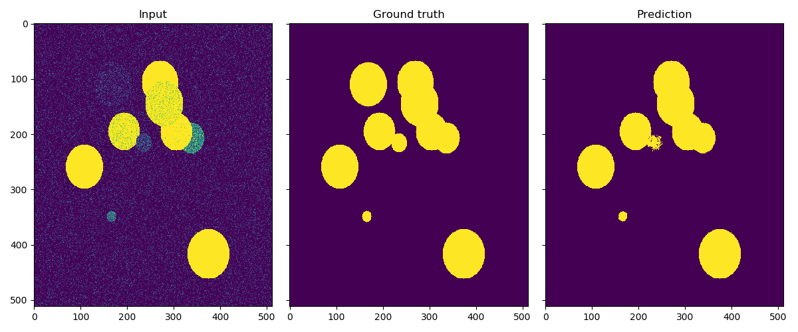

# Easy U-Net

This is a simple U-Net implementation developed with Tensorflow. 

Just use the followed command to train:

```
python train.py
```

Use the followed command to get the result:

```
python test.py
```

## Example


